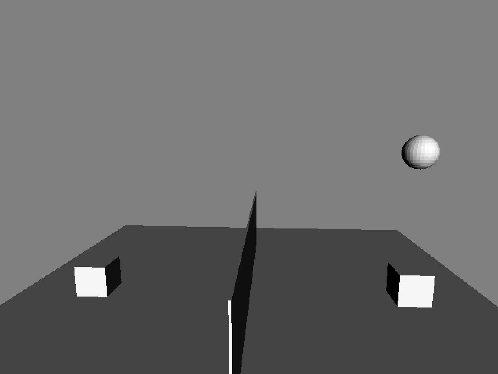

NOTE: please fill in the first section with information about your game.

# *Game Title*

Cube Volleyball [*Design Document*](http://graphics.cs.cmu.edu/courses/15-466-f17/game3-designs/rmukunda/) for game3 in 15-466-f17.



## Asset Pipeline

I used the export-meshes.py in the models folder that generates the scene.blob and meshes.blob files that are loaded into the game.

## Architecture

The game works on - checking Player collision with plane, player collision with the ball and simulating player/ball gravity. Every frame, the player cube is acted upon by gravity and its velocity and position changes accordingly until it collides with the plane. The sphere does the same. When the player hits the ball, the velocity of the player is transferred to the ball and the ball moves accordingly. Since I wanted the ball to move even the player was at rest (similar to arcade volleyball - the DOS game), I added a velocty based on the sphere's downward velocity based on the normal to the player collision.        

## Reflection

I started by exporting the meshes from blender and then went on to loading them into the scene. I decided to do vertex colors after completing the physics simulation, if there is time remaining. The plane cube and the cube gravity was easier as they were straigtforward velocity/position manipulations. However, I got stuck a bit on the sphere collisions. I started by implementing an elastic collision (assuming equal mass), thus exchanging the velocities of ball and player cube. However when the player is at rest, the ball was getting stuck to the surface of the player. So I added a velocity based on the player normal when at rest. In hindsight, I feel like an energy conservation equation might help transfer velocities between colliding objects in an easier way. Also, I didn't take into account the rotation of the the sphere.


# About Base2

This game is based on Base2, starter code for game2 in the 15-466-f17 course. It was developed by Jim McCann, and is released into the public domain.

## Requirements

 - modern C++ compiler
 - glm
 - libSDL2
 - libpng
 - blender (for mesh export script)

On Linux or OSX these requirements should be available from your package manager without too much hassle.

## Building

This code has been set up to be built with [FT jam](https://www.freetype.org/jam/).

### Getting Jam

For more information on Jam, see the [Jam Documentation](https://www.perforce.com/documentation/jam-documentation) page at Perforce, which includes both reference documentation and a getting started guide.

On unixish OSs, Jam is available from your package manager:
```
	brew install ftjam #on OSX
	apt get ftjam #on Debian-ish Linux
```

On Windows, you can get a binary [from sourceforge](https://sourceforge.net/projects/freetype/files/ftjam/2.5.2/ftjam-2.5.2-win32.zip/download),
and put it somewhere in your `%PATH%`.
(Possibly: also set the `JAM_TOOLSET` variable to `VISUALC`.)

### Bulding
Open a terminal (on windows, a Visual Studio Command Prompt), change to this directory, and type:
```
	jam
```

### Building (local libs)

Depending on your OSX, clone 
[kit-libs-linux](https://github.com/ixchow/kit-libs-linux),
[kit-libs-osx](https://github.com/ixchow/kit-libs-osx),
or [kit-libs-win](https://github.com/ixchow/kit-libs-win)
as a subdirectory of the current directory.

The Jamfile sets up library and header search paths such that local libraries will be preferred over system libraries.
